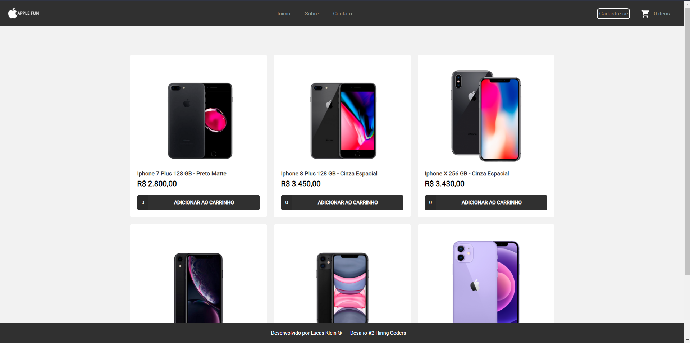

<h1 align="center">Apple-Fun - FakeApi</h1>

Projeto desenvolvido durante o Hiring coders da VTEX com Gama Academy!

Preview: https://apple-fun.netlify.app/

📖 - FakeApi criada para o Projeto para o Desafio 2 do #hiringcoders, com o intúito de desenvolver um sistema de E-commerce, que guarde dados de clientes, endereços, produtos, devidamente
estruturados no localstorage. Para este projeto, foi desenvolvido uma loja de fã da Apple, que possui sistema de cadastro e de carrinho com os produtos que estão cadastrados.

📖 - FakeApi  criada com o site <a href="https://my-json-server.typicode.com/">My Json Server</a>, utilizada para funcionar como uma "database" dos produtos

📖 - Link do Repositório do <a href="https://github.com/olucasklein/gama-apple-fun-fakeapi">Projeto Apple-Fun</a>  
